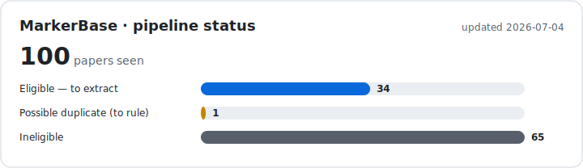

# PfDR MarkerBase — extraction pipeline

A self-running pipeline that triages papers for a database of *P. falciparum*
drug-resistance marker frequencies. PDFs are dropped into a Google Drive folder;
the pipeline reads each one, judges whether it's eligible for data extraction,
and keeps a running record of where every paper stands — checking in with a
human only when it genuinely needs a decision.

## Status

Updates automatically on every run.

## How it works

The pipeline runs in two stages.

**Stage 1 — eligibility** (every few hours, automatic). For each new PDF it:

1. **Skips** anything you've told it to ignore.
2. **Assesses** the rest against a clear eligibility spec (right parasite, target
   markers with extractable frequencies, sub-country location, ≤3-year window).
3. **Sorts** each into an outcome: *eligible* (ready for stage 2), *ineligible*
   (the majority), or **flagged** — needs a human because it might duplicate an
   existing study, or its data lives in supplementary files still to be uploaded.

**Stage 2 — extraction** (on demand). For eligible papers, an agent pulls the
marker data into the **STAVE** schema (study / survey / counts) and the real
STAVE R package validates it — anything malformed is sent back to the agent to
fix. Output lands in `data/extracted/<id>/`.

Nothing is ever looked at twice, and every paper's state is tracked in one file.
Once a week (Friday morning) you get a single GitHub issue summarising anything
waiting on you.

## What you need to do

The pipeline runs itself — you rarely touch anything. There are only **two
files** you ever edit, both directly in the GitHub web editor:

- **`data/exclude.txt`** — add a paper's filename here to skip it entirely.
- **`data/duplicate_decisions.yaml`** — when a paper is flagged as a possible
  duplicate, add one line ruling it `duplicate` or `unique`.

(The target markers to extract live in `config/target_loci.csv` — a reference
list you update when the marker set changes, not per-paper.)

That's it. The weekly issue tells you when either is needed (and when to upload a
paper's supplementary files to Drive). You never edit the code or the records the
pipeline keeps.

## More detail

Design rationale, the full file/secret reference, and how the Google Drive access
and contributor sharing work all live in **[docs/NOTES.md](docs/NOTES.md)**.
